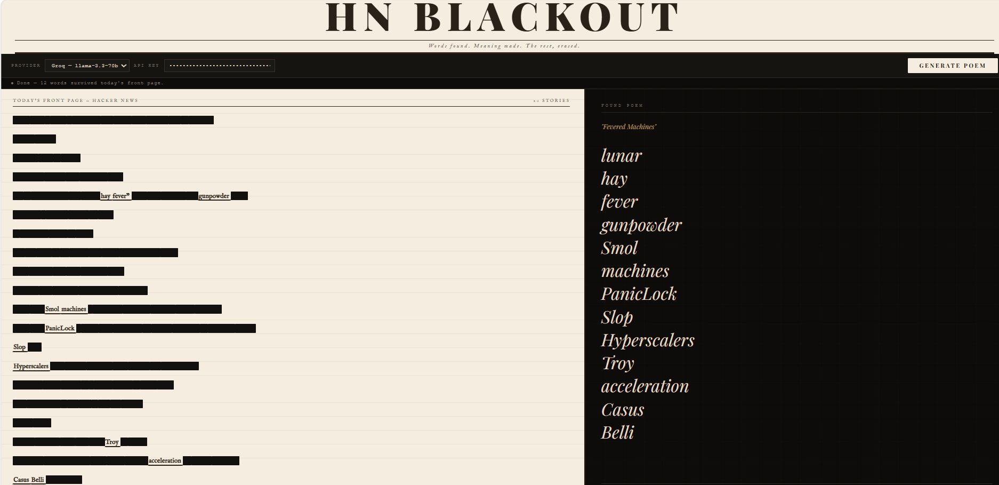

# HN Blackout

**Blackout poetry from the Hacker News front page.**

*Words found. Meaning made. The rest, erased.*



Inspired by [Austin Kleon's blackout poetry](https://austinkleon.com/category/newspaper-blackout-poems/), this tool fetches today's Hacker News headlines and asks an LLM to pick 10–15 words that form a haunting found poem. Everything else gets blacked out — marker-stroke animation and all.

---

## What it does

1. Pulls the top 20 stories from the HN Firebase API
2. Sends the headlines to your LLM of choice (Groq or Gemini)
3. The LLM selects words that form an evocative poem when read in sequence
4. The page animates: non-selected words are blacked out one by one
5. The surviving words appear as a found poem on the right panel

Each run produces a different poem — the headlines change daily, and the LLM makes different choices each time.

## Running

No server, no install. Just open the file:

```bash
xdg-open blackout.html   # Linux
open blackout.html        # macOS
```

Or serve it locally if you hit CORS issues:

```bash
python3 -m http.server 8080
# then open http://localhost:8080/blackout.html
```

## API Keys

You need a free API key from one of:

- **[Groq](https://console.groq.com)** — free tier, fast, uses `llama-3.3-70b-versatile`
- **[Google AI Studio](https://aistudio.google.com)** — free tier, uses `gemini-2.0-flash`

Keys are stored in `localStorage` — never sent anywhere except the provider's API directly from your browser.

## Example output

From a real run on April 18, 2026:

**"Fevered Machines"**

> lunar  
> hay  
> fever  
> gunpowder  
> Smol  
> machines  
> PanicLock  
> Slop  
> Hyperscalers  
> Troy  
> acceleration  
> Casus  
> Belli

The original HN headlines — "hay fever" and "gunpowder" from a history piece, "Smol machines" from an AI post, "PanicLock" and "Hyperscalers" from security and infra stories, "Casus Belli" from geopolitics — were blacked out except for these fragments.

## Architecture

Single static HTML file (`blackout.html`). All logic runs in the browser — no backend, no build step.

- HN data: [Firebase HN API](https://hacker-news.firebaseio.com/v0/) — public, no key needed
- LLM prompt: instructs the model to behave as a blackout poet, return JSON `{title, poem: [words]}`
- Tokenizer: splits each headline into word tokens, tracks which title each belongs to
- Matcher: finds each poem word in the token list (exact → case-insensitive → strip-punctuation fallback)
- Animation: non-selected words blacked out with a CSS marker-stroke keyframe, staggered across ~3.6 seconds
- Fonts: Playfair Display (poem panel) + IM Fell English (newspaper panel) from Google Fonts

## Part of the Vibe Coding series

This is one of a series of small, self-contained tools built with AI assistance. See the full series at [mrdee.in/vibecoding](https://mrdee.in/vibecoding).
